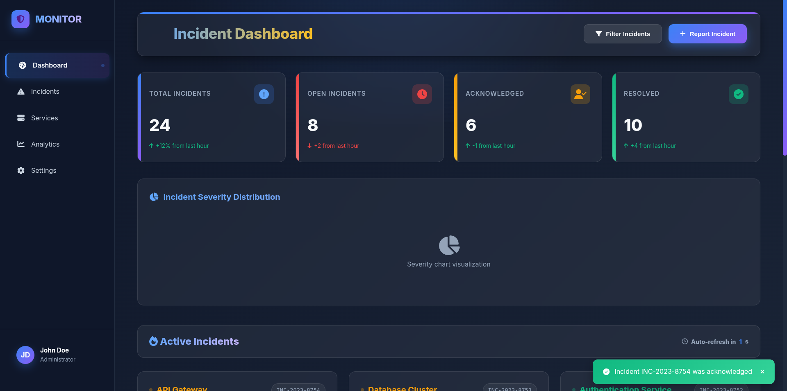
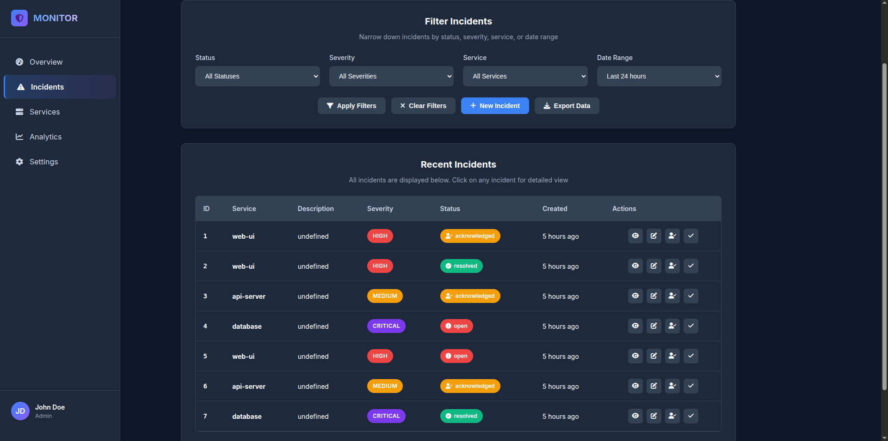
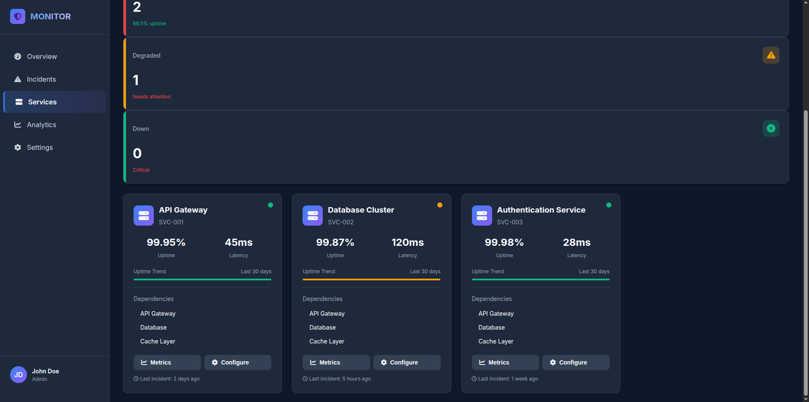
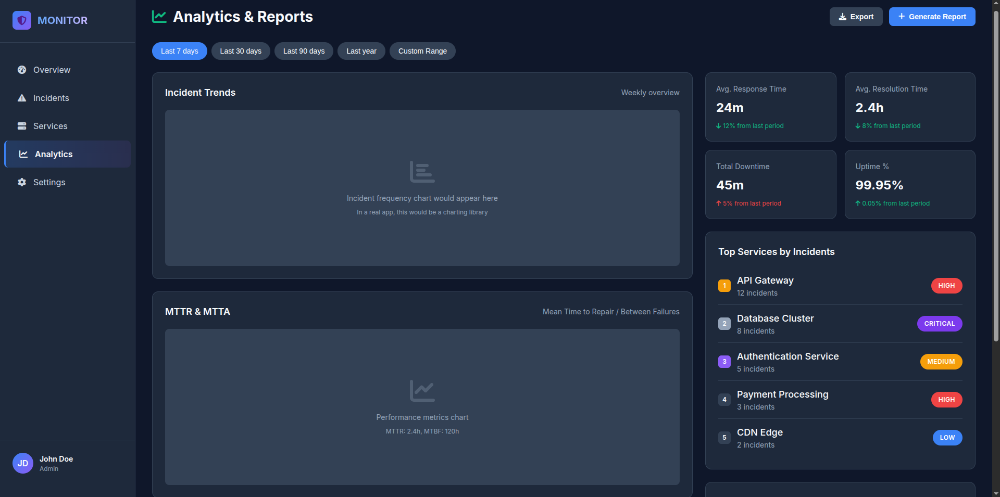
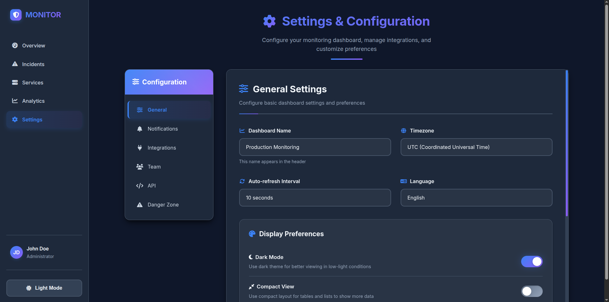
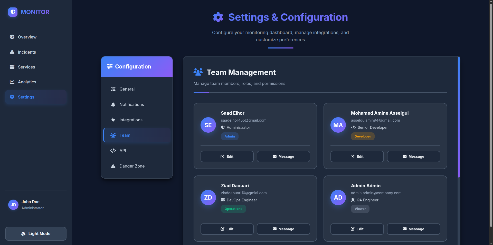

# DevOps Incident & On-Call Platform 🚨

**Hackathon Project - OpenSource Days 2026**  
*Local Edition: Production-Ready SRE Platform with Docker*

## 🖼 Architecture Overview


## 📋 Table of Contents
- [Quick Start](#quick-start)
- [Architecture](#architecture)
- [Services](#services)
- [API Examples](#api-examples)
- [Monitoring](#monitoring)
- [Project Structure](#project-structure)
- [API Schemas](#api-schemas)
- [Development](#development)
- [Security](#security)
- [Troubleshooting](#troubleshooting)

## 🚀 Quick Start

### 1. Prerequisites
- Docker 20.10+ & Docker Compose 2.0+
- 8GB RAM, 20GB disk space

### 2. Installation & Setup
```bash
# Clone repository
git clone <your-repository-url>
cd devops-incident-platform
```
## Start all services
```bash
docker compose up --build -d
```
## Check status
``` bash
docker compose ps
```

### 3. Verify Services
#### Health checks
``` bash
curl http://localhost:8001/health  # Alert Service
curl http://localhost:8002/health  # Incident Service
curl http://localhost:5000/health  # On-Call Service
```
### Access UIs
- **Web Dashboard**: http://localhost:8080
- **Grafana**: http://localhost:3000 (admin/admin)
- **Prometheus**: http://localhost:9090

### 4. Test Workflow
#### Send test alert
``` bash
curl -X POST "http://localhost:8001/api/v1/incidents" \
  -H "Content-Type: application/json" \
  -d '{
    "service": "frontend-api",
    "severity": "high",
    "description": "Test alert"
  }'
```
### Test on-call escalation
``` bash
curl -X POST "http://localhost:5000/api/alert" \
  -H "Content-Type: application/json" \
  -d '{
    "title": "Critical Alert",
    "severity": "critical"
  }'
```
### View incidents
``` bash
curl "http://localhost:8001/api/v1/incidents"
```
## 🏗 Architecture


**Figure 1:** End-to-end architecture of the platform. Alerts flow from external systems into the Alert Ingestion Service,
are correlated into incidents, assigned via the On-Call Service, and visualized through the Web UI and Grafana dashboards.

``` bash
External Alerts → Alert Service (8001) → Incident Service (8002)
                      ↓                          ↓
                 Web UI (8080)           On-Call Service (5000)
                      ↓                          ↓
                Prometheus (9090) ←─────→ Grafana (3000)
```
## Core Services:

1. **Alert Ingestion (8001)** - Receives & normalizes alerts
2. **Incident Management (8002)** - Lifecycle & MTTA/MTTR tracking
3. **On-Call Service (5000)** - Schedule management & escalation
4. **Web UI (8080)** - Real-time dashboard
5. **Monitoring Stack** - Prometheus + Grafana

### 🔧 Services
``` 
    Service	             Port	              Description
--------------------------------------------------------------------
Alert Ingestion	     |   8001	  |    Alert reception & correlation
--------------------------------------------------------------------
Incident Management	 |   8002	  |    Incident lifecycle tracking
--------------------------------------------------------------------
On-Call Service	     |   5000	  |    Schedule & escalation logic
--------------------------------------------------------------------
Web UI	             |   8080	  |    Dashboard & visualization
--------------------------------------------------------------------
Prometheus	         |   9090	  |    Metrics collection
--------------------------------------------------------------------
Grafana	             |   3000	  |    Dashboard visualization
```        
### 📡 API Examples
- Create Incident
```bash
curl -X POST "http://localhost:8001/api/v1/incidents" \
  -H "Content-Type: application/json" \
  -d '{
    "service": "database",
    "severity": "critical",
    "description": "Connection failure"
  }'
```

- Create Incident
```bash

curl "http://localhost:5000/api/current-oncall"
```
- Acknowledge Alert
``` bash
curl -X POST "http://localhost:5000/api/alerts/{id}/ack"
```

### 📊 Monitoring
- Metrics Endpoints
``` bash
curl http://localhost:8001/metrics     # Alert metrics
curl http://localhost:8002/metrics     # Incident metrics
curl http://localhost:5000/api/metrics # On-call metrics
```
- Key Metrics:
    -  `incidents_total` - Incident counts by status
    -  `incident_mtta_seconds` - Mean Time To Acknowledge
    -  `incident_mttr_seconds` - Mean Time To Resolve
    -  `alerts_received_total` - Alert volume by severity
    -  `escalations_total` - Escalation count
  
- Dashboards

    Live Incident Overview - Real-time status

    SRE Performance - MTTA/MTTR trends

    System Health - Service availability

## 🖥 Web Dashboard


### 📁 Project Structure

``` bash
devops-incident-platform/
├── docker-compose.yml          # Main orchestration
├── alert-ingestion/           # Alert Service
├── incident-service/          # Incident Service
├── oncall-service/           # On-Call Service
├── web-ui/                   # Web Dashboard
├── monitoring/               # Prometheus + Grafana
├── scripts/                  # CI/CD & utilities
└── images                     # images
```

### 🛠 Development

``` bash
# Development mode
docker compose up --build

# Run tests
docker compose run --rm alert-ingestion pytest

# View logs
docker compose logs -f
```

## 📊 Monitoring & Observability


**Figure 4:** Grafana dashboards displaying MTTA, MTTR, incident volume, and service health metrics collected by Prometheus.


### 🔒 Security
- Non-root container execution
- Environment variables for secrets
- Automated security scanning

### 🚨 Troubleshooting

``` bash
# Check ports
sudo lsof -i :8001

# View logs
docker compose logs

# Network issues
docker network inspect devops-incident-platform_default
```


## 📋 API Schemas

### Incident Schema
```json
{
  "id": "string",
  "service": "string",
  "severity": "critical|high|medium|low",
  "status": "open|acknowledged|in_progress|resolved",
  "description": "string",
  "created_at": "datetime",
  "acknowledged_at": "datetime|null",
  "resolved_at": "datetime|null",
  "mtta": "integer|null",
  "mttr": "integer|null",
  "assigned_to": "string|null"
}
```
### Alert Payload Schema

``` json
{
  "service": "string",
  "severity": "critical|high|medium|low",
  "message": "string",
  "labels": {
    "environment": "string",
    "region": "string",
    "component": "string"
  },
  "timestamp": "datetime",
  "annotations": {
    "summary": "string",
    "description": "string"
  }
}
```


### On-Call Schedule Schema
```json
{
  "date": "YYYY-MM-DD",
  "day": {
    "primary": "string",
    "secondary": "string"
  },
  "night": {
    "primary": "string",
    "secondary": "string"
  }
}
```


## 🖼 Platform Screenshots

### 📊 Dashboard Overview

<p align="center">
  
</p>

**Figure 1:** Main dashboard providing a real-time overview of active incidents, severity distribution, MTTA/MTTR indicators, and overall platform health.

---

### 🚨 Incident Management

<p align="center">
  
</p>

**Figure 2:** Incident management interface showing the full incident lifecycle, including acknowledgment, resolution status, severity levels, and on-call assignments.

---

### 🧩 Services Overview

<p align="center">
  
</p>

**Figure 3:** Services view listing all platform microservices, their health status, exposed ports, and runtime state within the Docker Compose environment.

---

### 📈 Analytics & Metrics

<p align="center">
  
</p>

**Figure 4:** Analytics dashboard displaying historical trends for incidents, MTTA/MTTR metrics, alert volume, and service reliability insights.

---

### ⚙️ Platform Settings

<p align="center">
  
</p>

**Figure 5:** Platform configuration settings for managing system behavior, alert thresholds, escalation rules, and operational preferences.

---

### 👥 Teams & On-Call Management

<p align="center">
  
</p>

**Figure 6:** Teams management interface showing team structures, on-call rotations, primary and secondary engineers, and escalation policies.


